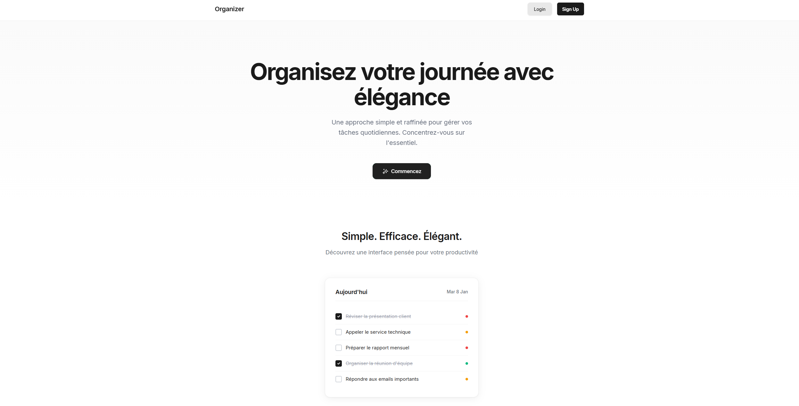

# Organizer
Une plateforme moderne de gestion de projets et de tâches en temps réel, conçue pour simplifier la collaboration d'équipe.

Version : 1.0.0
Stack : Fullstack JS

---

## Direction Artistique et Vision

L'application a été conçue autour de trois piliers fondamentaux : Clarté, Réactivité et Simplicité.

- Interface Épurée : Une palette de couleurs sobre mettant l'accent sur le contenu et les priorités.
- Expérience Fluide : Utilisation intensive du Drag and Drop pour une gestion intuitive des tâches.
- Collaboration Instantanée : Un retour visuel immédiat grâce aux WebSockets pour visualiser les membres en ligne et les modifications en direct.



---

## Fonctionnalités Clés

### Gestion de Workspace
- Création d'espaces de travail dédiés par projet ou par équipe.
- Gestion des membres et invitations par email.


### Tableaux et Listes
- Organisation des tâches en colonnes personnalisables.
- Système de Drag and Drop (React DnD) pour déplacer les cartes entre les étapes.
- Étiquettes (Labels) colorées pour catégoriser vos priorités.

### Temps Réel et Social
- Indicateur de présence : Visualisation des membres connectés en temps réel.
- Synchronisation Live : Les modifications apportées par un collaborateur apparaissent instantanément sans rafraîchir la page.
- Système d'invitations et de notifications intégré.

### Détails des Cartes
- Checklists intégrées pour suivre l'avancement précis.
- Descriptions détaillées et assignation de membres.


---

## Stack Technique

| Secteur | Technologies |
| :--- | :--- |
| Frontend | React 19, Vite, TypeScript, Vanilla CSS |
| Backend | Node.js, Express, PostgreSQL |
| Temps Réel | Socket.io |
| Auth | JWT (JSON Web Tokens), Bcrypt |
| D&D | React DnD |

---

## Installation et Lancement

### Pré-requis
- Node.js (v18+)
- PostgreSQL
- Docker (Optionnel, via docker-compose.yaml)

### 1. Cloner le projet
```bash
git clone <votre-url-repo>
cd TODOAPP
```

### 2. Configuration du Backend
```bash
cd back-end
npm install
# Crée un fichier .env (DB_URL, JWT_SECRET, PORT)
npm start
```

### 3. Configuration du Frontend
```bash
cd ../front-end
npm install
npm run dev
```

## Sécurité
- Hashage des mots de passe via Bcrypt.
- Protection des routes par Middlewares d'authentification.
- Validation rigoureuse des données entrantes.

---
